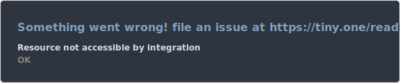

# Hello there!
I am John Paulsen, also known as Codinq online.\
I am currently a hobbyist, doing coding projects in my freetime. Looking to go to university to become a Computer Engineer.

## About Me

- 🌐 Website: [codinq.xyz](https://codinq.xyz/)
- 🔭 I’m currently working on: [fluid.codinq.xyz](https://fluid.codinq.xyz/)
- 🌱 I’m currently learning: more about the nuxt.js ecosystem

## My Skills

### Programming Languages
- JavaScript

### Frameworks & Libraries
- Vue *(intermediate)*
- Nuxt.js *(intermediate)*
- Discord.js *(intermediate)*
- MongoDB (using [mongoose](https://www.npmjs.com/package/mongoose)) *(intermediate)*

### Tools & Platforms
- Git *(beginner)*
- Linux *(intermediate)*
- Docker *(beginner)*

## Projects

### Fluid
Fluid is a Discord bot, which include music commands, an leveling system, and ways to check statistics from different games.

## Degrees

### Certificate of Apprenticeship
 - Production Electronics\
 2023-2026

## GitHub Stats

